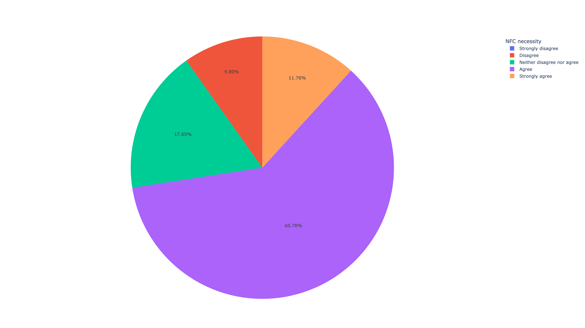
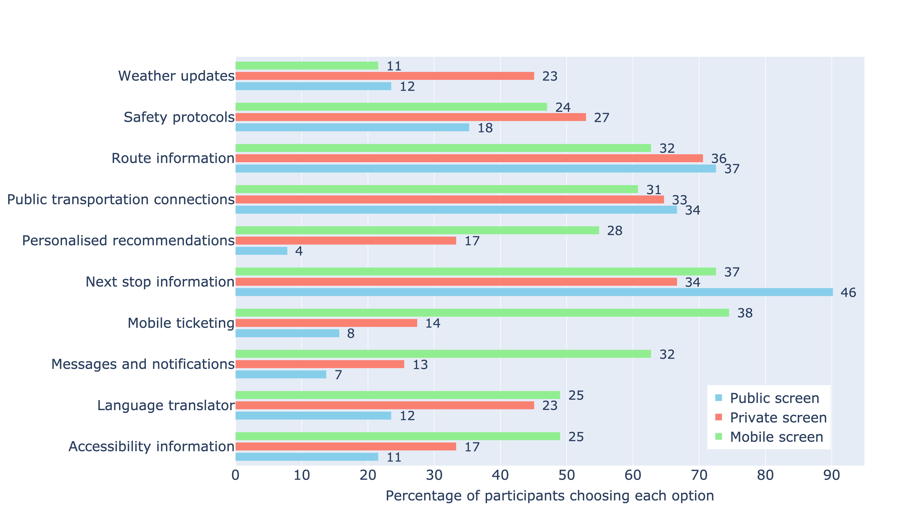

# Shuttle Bus Survey

The research question driving this study was: What specific information do shuttle bus passengers need, and how do they prefer to access this information during their journey? This study seeks to establish the formats of information that are of the most value to passengers, both marketable but common information (e.g., route descriptions and shuttle bus schedules) and less marketable but rather uncommon information (e.g., departure countdowns and accessibility-friendly routes). We are studying user preferences for this type of information representation and whether these views are presented on mobile devices, private screens, or public displays. We also provide functionalities such as Near Field Communication (NFC) to board and viewing assistance to allow passengers to position themselves exactly where the bus is going to come, which is beneficial in unfamiliar environments. This will allow evaluation of the passenger's efficiency, convenience and satisfaction related to using these features, leading to a set of actionable insights to be considered in designing user-centric transportation interfaces. This research specifically applies to automated shuttles, given that the study is prompted by the special needs and inclinations related to automated shuttle use.


## Citation
If you use the code or data for academic work please cite the following paper:

> Alam, M. S., Subramanian, T., Martens, M., Remlinger, W., & Bazilinskyy, P. (2024, September). From A to B with Ease: User-Centric Interfaces for Shuttle Buses. In Adjunct Proceedings of the 16th International Conference on Automotive User Interfaces and Interactive Vehicular Applications (pp. 111-116). Stanford, CA, USA. https://doi.org/10.1145/3641308.3685033


## Usage of the code
The code is open-source and free to use. It is aimed for, but not limited to, academic research. We welcome forking of this repository, pull requests, and any contributions in the spirit of open science and open-source code 😍😄 For inquiries about collaboration, you may contact Md Shadab Alam (md_shadab_alam@outlook.com) or Pavlo Bazilinskyy (pavlo.bazilinskyy@gmail.com).

## Getting Started
Tested with Python 3.9.19. To setup the environment run these two commands in a parent folder of the downloaded repository (replace `/` with `\` and possibly add `--user` if on Windows:

**Step 1:**  

Clone the repository
```command line
git clone https://github.com/Shaadalam9/shuttle-boarding.git
```

**Step 2:** 

Create a new virtual environment
```command line
python -m venv venv
```

**Step 3:** 

Activate the virtual environment
```command line
source venv/bin/activate
```

On Windows use
```command line
venv\Scripts\activate
```

**Step 4:** 

Install dependencies
```command line
pip install -r requirements.txt
```

# Usage

**Data preparation**

Response data from the participants is available at [4TU Research Data](http://doi.org/10.4121/76432912-37c4-4603-97e7-9cabbaba653e).

### Filtering of response
Data from the response is filtered based on the following criteria:
1. People who did not read instructions.
2. People who did not give consent.

### Configuration of project
Configuration of the project needs to be defined in `shuttle-boarding/config`. Please use the `default.config` file for the required structure of the file. If no custom config file is provided, `default.config` is used. The config file has the following parameters:
* `data`: location of the response file.
* `plots`: location for the saving the figures.
* `plotly_template`: template used to make graphs in the analysis.

## List of Figures

1. [Gender Distribution](#gender-distribution)
2. [Age Distribution](#age-distribution)
3. [Country Distribution](#country-distribution)
4. [Use of Micro-Mobility](#use-of-micro-mobility)
5. [Use of Public Bus](#use-of-public-bus)
6. [Viewing Assistance](#viewing-assistance)
7. [NFC Feature](#nfc-feature)
8. [Information Required Preboarding](#information-required-preboarding)
9. [Information Required Onboarding](#information-required-onboarding)
10. [Correlation Matrices](#correlation-matrices)

## Visualizations

### Gender Distribution

[](https://htmlpreview.github.io/?https://github.com/Shaadalam9/shuttle-boarding/blob/main/plots/gender_pie.html)
Graph showing the distribution of gender in the survey responses.

### Age Distribution

[](https://htmlpreview.github.io/?https://github.com/Shaadalam9/shuttle-boarding/blob/main/plots/age.html)
Graph showing the age distribution of the survey participants.

### Country Distribution

[](https://htmlpreview.github.io/?https://github.com/Shaadalam9/shuttle-boarding/blob/main/plots/country_pie.html)
Graph illustrating the distribution of participants by their current country of residence.

### Use of Micro-Mobility

[](https://htmlpreview.github.io/?https://github.com/Shaadalam9/shuttle-boarding/blob/main/plots/micro-mobility.html)
Graph showing how frequently participants use micro-mobility options such as e-scooters, bicycles, or e-bikes.

### Use of Public Bus

[](https://htmlpreview.github.io/?https://github.com/Shaadalam9/shuttle-boarding/blob/main/plots/bus_use.html)
Graph depicting how often participants use public bus services.

### Viewing Assistance
Viewing assistance is a feature designed to help passengers navigate and position themselves accurately at shuttle bus stops. This tool assists users in determining the exact location where they should stand to board the shuttle bus, particularly in unfamiliar environments. By utilizing real-time guidance through mobile devices, viewing assistance can overcome navigation challenges and language barriers, ensuring a smooth and efficient boarding process.


The above image shows users the location as a glow-in-the-environment where they need to stand in order to catch their bus.

[](https://htmlpreview.github.io/?https://github.com/Shaadalam9/shuttle-boarding/blob/main/plots/viewing_assistance.html)
Graph displaying participants' opinions on the necessity of viewing assistance for navigating new places or overcoming language barriers.

### NFC Feature

[](https://htmlpreview.github.io/?https://github.com/Shaadalam9/shuttle-boarding/blob/main/plots/NFC.html)
Graph illustrating participants' opinions on the necessity of Near-Field Communication (NFC) for navigating unfamiliar environments or overcoming language barriers.

### Information Required Preboarding

[](https://htmlpreview.github.io/?https://github.com/Shaadalam9/shuttle-boarding/blob/main/plots/info_mobile_pre.html)
Graph showing the types of information participants prefer to receive on mobile devices before boarding the shuttle bus.

### Information Required Onboarding

[](https://htmlpreview.github.io/?https://github.com/Shaadalam9/shuttle-boarding/blob/main/plots/info_onboard.html)
Graph depicting the types of information participants prefer to receive on mobile, private, or public screens while onboard the shuttle bus.

### Correlation Matrices

[](https://htmlpreview.github.io/?https://github.com/Shaadalam9/shuttle-boarding/blob/main/plots/pre_and_on_mobile_and_pre_public.html)
Correlation matrix between information on mobile screen pre-boarding vs information on public screen pre-boarding and information on mobile screen during the journey.

[](https://htmlpreview.github.io/?https://github.com/Shaadalam9/shuttle-boarding/blob/main/plots/combined_correlation_matrix_lower_triangle_plotly.html)
Correlation matrix showing the relationships between different information preferences and display methods.


## License
This project is licensed under the MIT License. See the LICENSE file for details.
