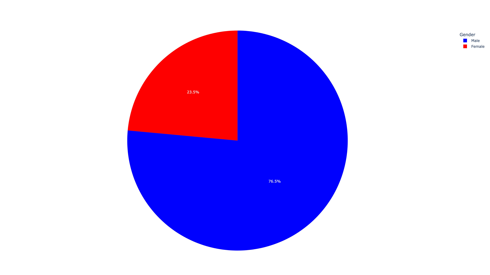
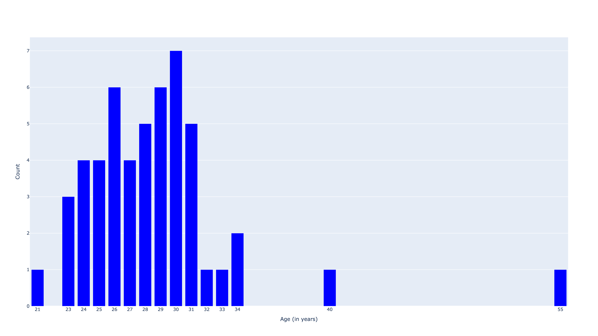
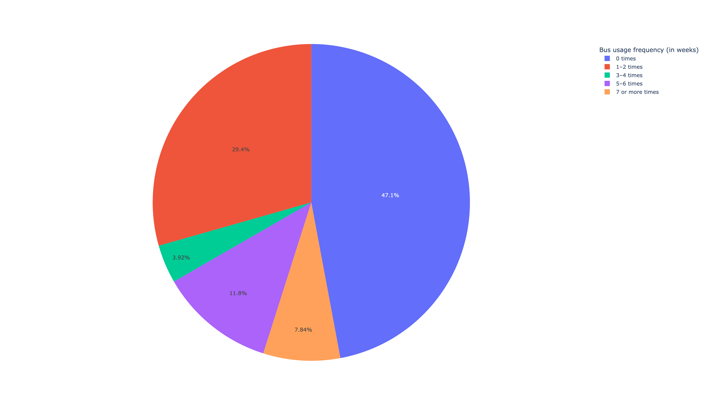
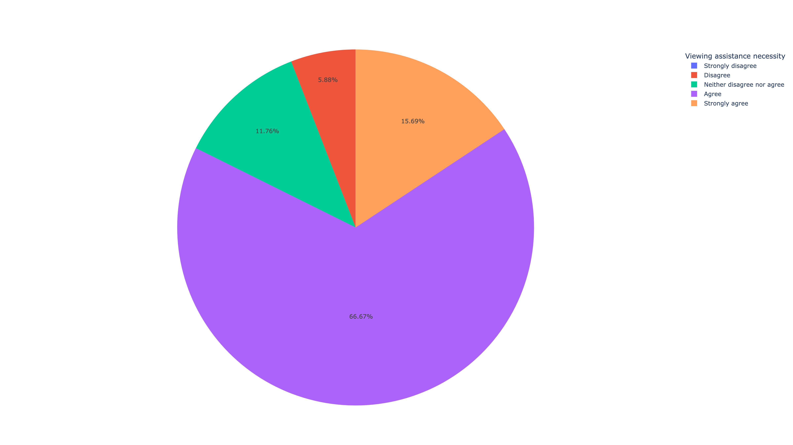
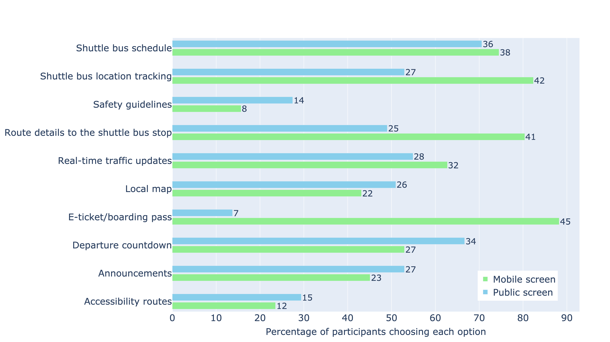

# Shuttle Bus Survey

This repository contains visualizations for the Shuttle Bus Survey. The visualizations include various demographic distributions, micro-mobility usage, and information preferences before and after boarding the shuttle bus.

## Author

This code was developed by [md_shadab_alam@outlook.com](mailto:md_shadab_alam@outlook.com).

## Table of Contents

1. [Gender Distribution](#gender-distribution)
2. [Age Distribution](#age-distribution)
3. [Country Distribution](#country-distribution)
4. [Use of Micro-Mobility](#use-of-micro-mobility)
5. [Use of Public Bus](#use-of-public-bus)
6. [Viewing Assistance](#viewing-assistance)
7. [NFC Feature](#nfc-feature)
8. [Information Required Preboarding](#information-required-preboarding)
9. [Information Required Onboarding](#information-required-onboarding)
10. [Correlation Matrices](#correlation-matrices)

## Visualizations

### Gender Distribution

### Age Distribution

### Country Distribution

### Use of Micro-Mobility

### Use of Public Bus

### Viewing Assistance

### NFC Feature

### Information Required Preboarding

### Information Required Onboarding

### Correlation Matrices

